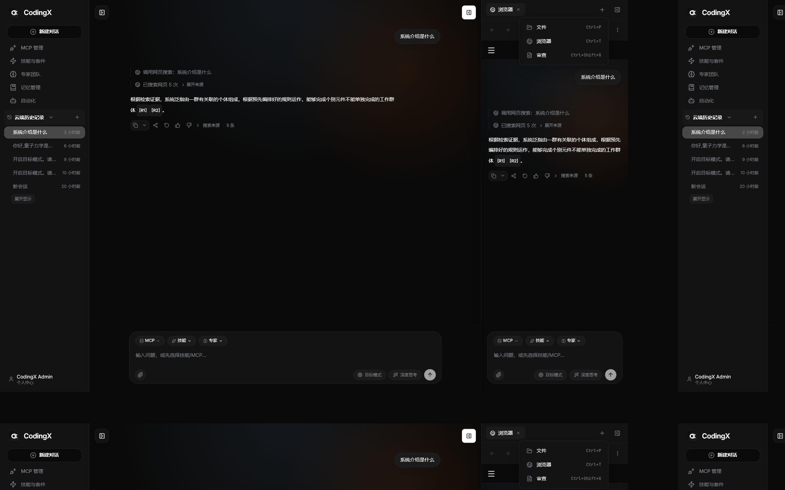

# 聊天右侧工作台

## 功能用途

聊天页右上角提供一个仅图标的右侧工作台按钮。用户按需展开后，侧栏不再只承载代码差异，而是提供“文件”“浏览器”“审查”三个桌面工作流入口，并通过顶部选项卡在多个功能之间切换。

## 参考截图

用户补充的当前页面截图已作为前端视觉参考保存到功能文档资产目录，后续调整右侧工作台时需优先对照按钮位置、侧栏层级、选项卡入口和 diff 展示密度。

| 截图 | 参考重点 | 当前实现 |
| --- | --- | --- |
| 截图 1 | 右侧栏默认入口展示“文件、侧边聊天、浏览器、审查、终端”等大按钮 | 当前先实现“文件、浏览器、审查”三个已明确要求的入口，保持深色大按钮布局与快捷键提示 |
| 截图 2 | “审查”选项卡内展示差异类型、文件列表、红绿 diff 和完整滚动内容 | 审查 tab 复用会话差异与 `git_diff` 工作区差异，新增内容绿色、删除内容红色，完整 diff 不截断 |
| 截图 3 | 文件选项卡顶部有路径面包屑，右侧有目录树，左侧显示文件内容 | 文件 tab 使用当前 workspace 路径构造面包屑，右侧目录来自桌面宿主 `listDirectory`，点击文件后左侧只读展示文本 |
| 截图 4 | 文件目录可被右上角文件夹按钮折叠，只保留文件内容区 | 文件 tab 顶部文件夹按钮可折叠/展开右侧目录列 |
| 截图 5 | 选项卡加号菜单可添加文件、侧边聊天、浏览器、终端等面板 | 当前加号菜单提供“文件、浏览器、审查”，点击已有类型会激活既有 tab，避免重复堆叠 |
| 截图 6 | 浏览器 tab 有后退、前进、刷新、地址栏、外部打开等控件 | 浏览器 tab 内置 iframe 预览，地址栏回车导航，并提供后退、前进、刷新和调用系统默认浏览器的外部打开按钮 |
| 截图 7 | 浏览器更多菜单包含强制重新加载、设备工具栏、缩放、清 Cookie、清缓存 | 更多菜单提供强制重新加载、打开开发者工具、缩放、清 Cookie 和清缓存入口；截图按钮会截取浏览器预览区域并写入系统剪贴板 |

## 使用入口

用户在聊天页右上角点击侧栏图标打开工作台。初始状态展示功能入口；点击“文件”“浏览器”或“审查”后，顶部创建对应选项卡。选项卡可以切换、关闭，也可以通过顶部加号菜单再次添加。

## 核心流程

1. 页面渲染时 `ChatView` 只展示图标按钮，不显示“代码差异”文字；按钮的 `aria-label` 表示打开或关闭右侧工作台。用户点击后，`RightWorkbenchSidebar` 按保存的宽度从右侧展开，并显示默认入口或当前活动 tab。侧栏从中等宽度视口开始可见，避免桌面窗口未达到大屏断点时出现“按钮已切换但侧栏被隐藏”的状态。
2. 默认入口读取 `RIGHT_WORKBENCH_TOOLS` 配置，渲染文件、浏览器和审查三个按钮。点击某个按钮时先查找是否已有同类型 tab，已有则直接激活，没有则创建新 tab 并把它设为活动项；关闭活动 tab 时回退到邻近 tab，没有剩余 tab 则回到默认入口。
3. 审查 tab 内部使用 `CodeReviewPanel` 聚合会话消息里的 `fileDiffs`。本轮和上轮模式直接读取消息过程卡片；未暂存、已暂存、提交、分支模式通过 `ChatApi.invokeTool(token, 'git_diff', { mode }, { workspaceId, repositoryPath })` 读取当前工作区差异。diff 面板沿用完整行渲染，不再只显示最新若干行。
4. 文件 tab 先从当前聊天 workspace 获取 `workspacePath` 和 `workspaceLabel`。桌面端通过 `resolveHostBridge().listDirectory(currentDirectory)` 读取目录项，并按目录优先排序；用户点击目录会进入该目录，点击文件时通过 `readTextFile(path)` 获取只读文本内容。主进程只允许读取已绑定仓库内的普通文件，且单文件预览限制为 1MB；如果旧桌面进程缺少 `host:read-text-file` handler，前端会提示用户重启 CodingX，而不是直接展示 Electron 原始报错。
5. 浏览器 tab 的地址栏输入先经过 URL 规范化：完整 URL 原样使用，localhost 或域名自动补 `http://`，普通文本兜底为搜索地址。导航会写入本地 history 栈，后退/前进从栈中切换 URL；刷新通过更新 iframe key 强制重新加载。外部打开按钮在桌面端调用 `host:open-external-url`，由 Electron 主进程 `shell.openExternal` 交给用户系统默认浏览器；Web 调试环境才回退到 `window.open`。
6. 浏览器 tab 的截图按钮通过桌面宿主桥接把可见浏览器预览区域传给主进程。主进程调用 `webContents.capturePage` 截图并用 `clipboard.writeImage` 写入系统剪贴板；不支持宿主截图能力的 Web 环境会展示“不支持截图到剪贴板”的提示。更多菜单的“打开开发者工具”调用已有 `toggle-dev-tools` 桌面菜单动作，直接打开 Electron 开发者工具。
7. 工作台宽度由左侧拖拽条调整。拖动开始时记录鼠标位置和当前宽度，移动时按“右侧固定面板”规则计算新宽度，向左拖宽、向右拖窄，并限制在 340 到 760 像素及当前视口可用范围内。

## 关键文件

- `frontend/user/src/views/ChatView.tsx`：渲染右侧工作台、入口、选项卡、文件面板、浏览器面板和审查面板。
- `frontend/user/src/host/types.ts`：定义用户端宿主桥接中的只读文本文件返回结构、外部打开和截图区域协议。
- `frontend/user/src/host/bridge.ts`：Web 环境提供安全降级，无法读取本地文件或截图到剪贴板时返回中文错误或不支持状态。
- `frontend/desktop/src/main.ts`：注册 `host:read-text-file`、`host:open-external-url` 和 `host:capture-workbench-browser-screenshot`，限制文件读取范围，并把浏览器截图写入系统剪贴板。
- `frontend/desktop/src/preload.ts`：向渲染层暴露 `readTextFile`、`openExternalUrl` 和 `captureWorkbenchBrowserScreenshot`。
- `frontend/desktop/src/types.ts`：定义桌面端 `LocalTextFileContent` 和浏览器截图区域结构。

## 测试与验证

- `npm run test:run -- tests/views/ChatView.test.tsx -t "右侧工作台|文件选项卡|桌面宿主打开外部浏览器|桌面文件预览能力未加载"`
- `npm run test:run -- tests/views/ChatView.test.tsx -t "应完整展示流式写入中的大文件差异|应在同一文件差异流式更新时保持内嵌弹窗节点稳定"`
- `npm run build`
- `cd ../desktop && npm run build && npm run test:run`
- 前端视觉变更需通过浏览器打开 `http://localhost:5002/?conversationId=2064662880087269376`，确认右上角图标按钮、默认入口、审查 tab、文件 tab、浏览器 tab 和更多菜单可见。
